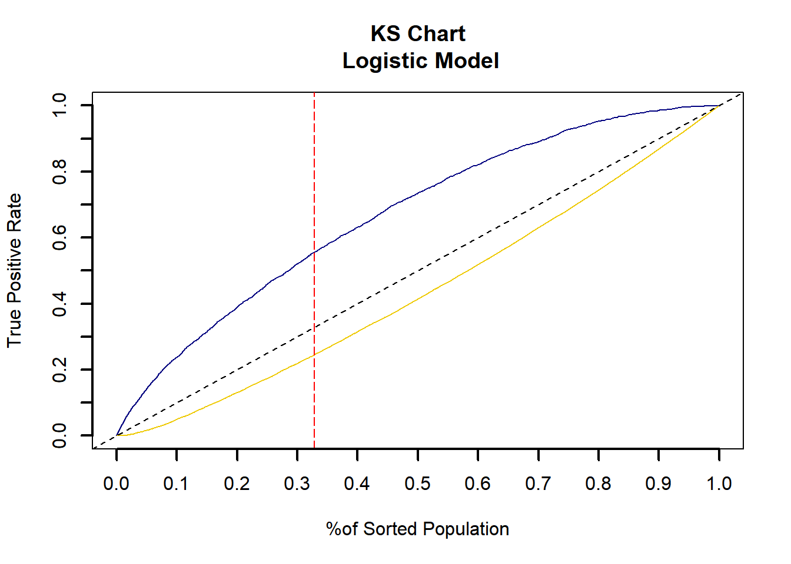
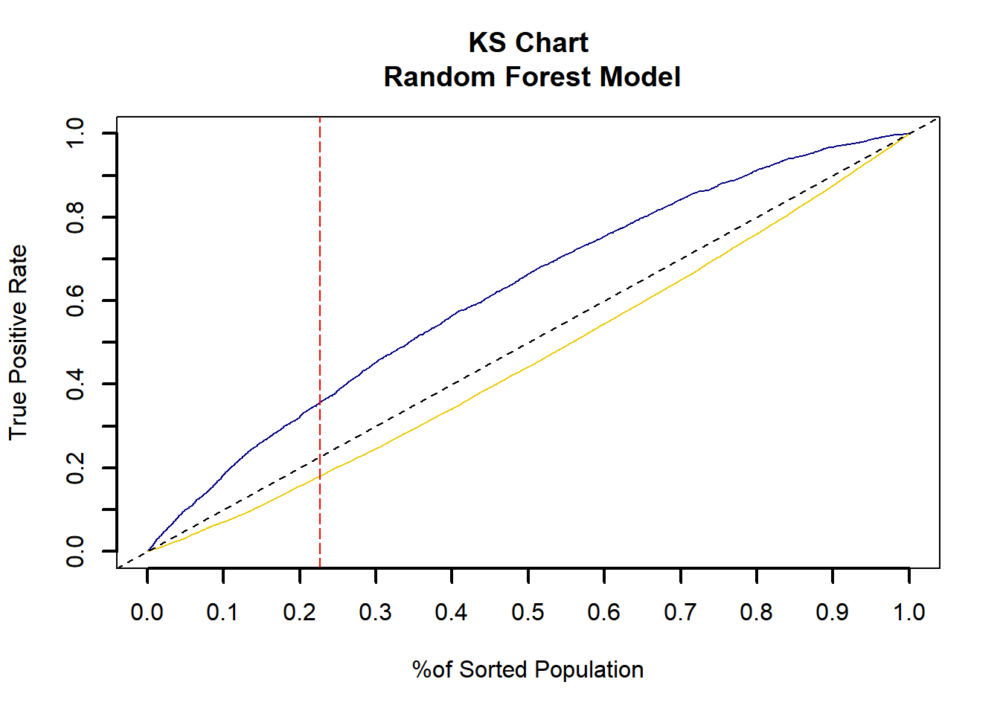
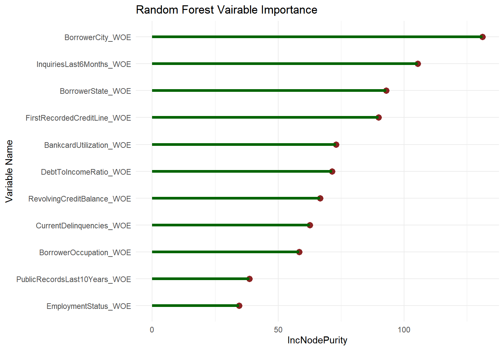

# Loan Default Prediction Using Weight of Evidence (WOE), Binning, and Machine Learning

## Overview
This project focuses on building predictive models to assess loan default risk using real-world data from Prosper.com. The goal is to develop accurate and interpretable models that identify borrowers who are at higher risk of default. The project follows a structured data science workflow, incorporating data cleaning, exploratory analysis, feature engineering, model development, and evaluation.

---

## Key Highlights
- **Exploratory Data Analysis (EDA):** Gained insights into borrower financial health, credit history, and loan performance.
- **Feature Engineering:** Applied binning techniques, handled missing values strategically, and transformed categorical data.
- **Predictive Modeling:**
  - Logistic Regression (baseline model for interpretability)
  - Random Forest (more accurate model for stronger predictive power)
- **Model Evaluation:**
  - Compared models using ROC-AUC scores, KS statistic, gains table, and feature importance analysis.

---

## Dataset Overview
The dataset used in this analysis comes from Prosper.com, a peer-to-peer lending platform. It includes detailed loan performance data, offering valuable insights into borrower creditworthiness and financial behavior.

- **Total observations:** 18,987 rows (individual loans)
- **Total features:** 30 columns relating to financial, demographic, and loan-related attributes
- **Variable types:**
  - **Numerical:** Debt-to-Income Ratio, Amount Delinquent, Revolving Credit Balance
  - **Categorical:** Employment Status, Borrower State, Homeownership Status
  - **Temporal:** First Recorded Credit Line (originally stored as a timestamp)
- **Target Variable:** `Bad` (Binary: `1 = Loan Default`, `0 = No Default`)

---

## Data Preprocessing
Before analysis, several preprocessing steps were applied to clean and structure the data for modeling. These steps ensured data consistency and improved predictive power.

### 1. Handling Missing Data
The dataset initially contained **25,606 missing values**, accounting for **11.24% of the total data**. Key financial variables like **Debt-to-Income Ratio, Public Records, and Bankcard Utilization** had missing values.

#### Why Keep Missing Data?
Missing data is not always random and can provide valuable insights into borrower behavior. Instead of removing records and losing potentially useful information, missing values were categorized and binned to retain their predictive power.

- **Indicating risk:** Borrowers who do not disclose certain financial details may have different risk levels.
- **Preventing bias:** Removing missing data might exclude certain borrower groups, reducing model accuracy for new applicants.
- **Retaining insights:** Since a large portion of the data is missing, removing it entirely would weaken the model’s ability to identify meaningful patterns.

#### Approach to Handling Missing Data
- **Categorizing Missing Values:** Instead of filling in missing values with averages or random estimates, they were treated as a separate category.
- **Evaluating Predictive Power:** Analyzed whether missing values were linked to loan defaults. Keeping them as a separate category allowed the model to leverage potential risk patterns.

---

### 2. Transforming Variables
To improve model performance and interpretability, several variables were adjusted:

- **Credit History Length:** The `FirstRecordedCreditLine` variable was converted from a timestamp to the number of years since the borrower’s first credit event.
- **Homeownership Status:** The `IsBorrowerHomeowner` variable, originally stored as `TRUE/FALSE`, was converted to binary values (`1 = Yes`, `0 = No`).

---

### 3. Binning Continuous Variables
Continuous variables were binned into categorical groups to enhance model performance. 

- **Debt-to-Income Ratio:** Borrowers were grouped based on DTI levels to reduce noise and improve model interpretability.
- **Credit Utilization & Delinquencies:** Outliers in **BankcardUtilization** and **CurrentDelinquencies** were binned to retain valuable insights while reducing the impact of extreme values.
- **Borrower Occupation Categorization:** The `BorrowerOccupation` field contained unstructured text with a variety of job titles. To improve reliability, similar occupations were grouped into broader categories:

  - **Business & Finance** (e.g., Accountants, Financial Analysts, Bankers)
  - **Trades & Skilled Labor** (e.g., Electricians, Carpenters, Plumbers)
  - **Service Industry** (e.g., Retail Workers, Hospitality, Food Service)
  - **Healthcare & Education** (e.g., Nurses, Teachers, Therapists)
  - **Science & Technology** (e.g., Engineers, IT Professionals, Data Scientists)
  - **Other** (e.g., Unemployed, Retired, Self-Employed with undefined roles)

By standardizing job titles, the model could better identify trends in loan default risk while reducing the impact of inconsistent labels.

---

### 4. Feature Selection
Feature selection ensured that only the most relevant and impactful variables were included in predictive modeling. The objective was to retain features that contributed significantly to distinguishing between default and non-default loans while removing redundant predictors.

#### Selection Process:
- **Information Value (IV) Analysis:** Features with **IV > 0.025** were prioritized for their strong predictive power.
- **Weight of Evidence (WOE) Transformation:** Continuous variables were binned and converted to WOE values to structure risk levels effectively.
- **Business Relevance:** Variables related to **Debt-to-Income Ratio, Credit Utilization, Delinquencies, and Employment Status** were included based on their real-world importance.
- **Multicollinearity Check:** Highly correlated features were flagged, and only the most informative ones were retained.
- **Statistical Significance Testing:** Ensured that only variables with a meaningful impact on loan default were included.

#### Final Selected Features:
The highest-ranking features based on IV scores included:

| Feature                         | IV Score  |
|---------------------------------|----------|
| `BorrowerCity_Bins`             | 0.2725   |
| `InquiriesLast6Months_Bins`     | 0.2186   |
| `BankcardUtilization_Bins`      | 0.0879   |
| `CurrentDelinquencies_Bins`     | 0.0805   |
| `AmountDelinquent_Bins`         | 0.0722   |

Additional features, such as **BorrowerOccupation_Bins, DebtToIncomeRatio_Bins, and PublicRecordsLast10Years_Bins**, were included based on their moderate IV values, contributing to overall model performance.

By carefully selecting features based on their predictive strength and real-world relevance, the final dataset was optimized for modeling, leading to a more interpretable and effective risk assessment model.

## Exploratory Data Analysis (EDA)

The exploratory data analysis (EDA) phase helped uncover important trends and relationships in borrower data, allowing us to better understand the factors that contribute to loan default. By analyzing distributions, correlations, and key financial indicators, we gained insights that guided feature selection and model development.

---

### Key Takeaways from EDA

EDA revealed clear patterns in borrower demographics, financial behaviors, and credit history that were strongly linked to loan default risk. Here are some of the most important findings:

- **Loan Default Trends:** Borrowers with lower credit scores, higher debt-to-income (DTI) ratios, and shorter credit histories were more likely to default.
- **Geographic Differences:** Some states and metro areas had higher default rates than others, likely due to factors like local economic conditions, job market stability, or differences in lending policies.
- **Income and Creditworthiness:** Borrowers with higher incomes generally had better credit, but a high income didn’t always guarantee financial stability. Some high earners still defaulted, often due to high revolving credit balances or past delinquencies.
- **Debt-to-Income Ratio Impact:** Borrowers with a DTI ratio over 40% were significantly more likely to default on their loans.
- **Credit Utilization & Delinquencies:** Borrowers who used more than 80% of their available credit and had a history of multiple past delinquencies were at a significantly higher risk of defaulting.
- **Employment & Default Risk:** Borrowers working in trades, the service industry, and those who were self-employed tended to have higher default rates, whereas borrowers employed in technology, healthcare, and finance showed lower risk levels. This trend suggests that job stability and income predictability may play a key role in a borrower's ability to repay loans.

---

### Statistical & Distribution Analysis

- **Correlation Analysis:** Identified strong relationships between financial indicators and loan default, particularly credit utilization, delinquency count, and DTI ratio.
- **Distribution Analysis:** Examined borrower credit scores, annual income distributions, and loan amounts to distinguish key differences between defaulters and non-defaulters.
- **Outlier Detection:** Found extreme values in credit utilization and delinquency counts, which were addressed through binning and transformations during preprocessing.

---

### Visualizing Loan Default Risk

To better understand the relationships between borrower characteristics and loan default risk, several data visualizations were created based on the insights gathered from EDA.

#### Distribution of Loans by Occupation Category

- This bar chart illustrates the number of loans across different occupation categories. The "Other" category has the highest number of loans. Recall that job titles were originally entered as free text, emphasizing the wide range of borrowers whose job titles didn’t fit neatly into a specific category.

#### Proportion of Bad Loans by Occupation Category

- This visualization shows that trades, service industry, and public service occupations experience the highest default rates, indicating that employment stability plays a key role in loan repayment ability.

#### Average Default Rate by Employment Status

- Retired and self-employed borrowers show the highest loan default rates, suggesting that income stability is a strong predictor of credit risk.

#### Debt-to-Income Ratio by Occupation Category

- This box plot shows how debt-to-income ratios vary across different occupation groups. While most categories have a similar median DTI, outliers exist in every category, affecting overall risk assessment.

#### Histogram of Current Delinquencies

- Most borrowers have no delinquencies, but a small group has a high number of delinquencies, making it an important risk factor to consider.

#### Histogram of Bankcard Utilization

- Most borrowers keep their credit utilization low, but a small group with very high utilization stands out. These overextended borrowers may be at a higher risk of default.

#### Inquiries in the Last 6 Months Binned by WoE

- **Weight of Evidence (Left Plot):** WoE measures how strongly a feature separates good vs. bad borrowers. Positive WoE means higher risk, while negative WoE means lower risk. Borrowers with 0 inquiries have a negative WoE, indicating lower risk. In contrast, those with 13+ inquiries have the highest WoE, making them strongly linked to a higher risk of defaulting.
- **More Credit Inquiries = Higher Default Risk (Middle Plot):** The default rate increases as the number of inquiries goes up. Borrowers with fewer inquiries are generally more reliable, while those with 6 or more inquiries are much more likely to default, possibly because they’re struggling financially or frequently seeking new credit.
- **Most Borrowers Have Few Inquiries (Right Plot):** The majority of borrowers fall into the 0-2 inquiries range, meaning frequent credit applications are uncommon. This reinforces the idea that borrowers with many inquiries might be outliers and at higher risk.
- **Handling Missing Inquiry Data:** Only a small number of borrowers have missing inquiry data, as shown in the bin frequency plot (right). Their slightly negative WoE suggests they have a lower risk of default, similar to borrowers with 0 inquiries. Unlike borrowers with many inquiries, missing values don’t show a clear link to higher risk. Instead of removing these records, treating them as a separate category allows the model to capture any hidden patterns that might still be relevant.

---

### Summary of EDA Findings

The exploratory data analysis revealed key factors influencing loan default, providing critical insights through statistical evaluations and visualizations:

- **High-Risk Borrower Profiles:** Borrowers with high DTI ratios, frequent credit inquiries, and elevated bankcard utilization were at a significantly higher risk of default.
- **Employment & Income Stability:** Self-employed and retired borrowers had the highest default rates, reinforcing the importance of income stability in risk assessment.
- **Geographic & Occupational Risk Factors:** Certain regions and job sectors were found to have higher default probabilities.
- **Credit History & Delinquencies:** Past delinquencies emerged as strong predictors of default, highlighting their importance in assessing borrower risk.

These findings directly shaped our feature engineering and model selection, helping us refine our approach and build more effective predictive models for assessing borrower risk.

## Predictive Modeling

After all input variables were binned and each binned variable’s data was examined, their predictive significance was determined. Two models were created: a logistic regression model and a random forest model. The input variables for all models contained an IV greater than 0.025. Each model was built using a 60% (11,393 observations) - 40% (7,594 observations) training-to-test split.

---

### Logistic Regression Model

The first model to discuss is the logistic regression model, built using the WOE values of the input variables. Only the statistically significant variables were included in the final model.

#### Logistic Regression Model Coefficients of Significant Variables

| Variable                         | Coefficient  |
|----------------------------------|-------------|
| Intercept                        | -1.13921    |
| BorrowerCity_WOE                 | 1.53496     |
| InquiriesLast6Months_WOE         | 0.87247     |
| BankcardUtilization_WOE          | 0.63405     |
| CurrentDelinquencies_WOE         | 0.74926     |
| BorrowerState_WOE                | 0.60786     |
| RevolvingCreditBalance_WOE       | 0.48976     |
| BorrowerOccupation_WOE           | 0.77064     |
| PublicRecordsLast10Years_WOE     | 0.42573     |
| EmploymentStatus_WOE             | 0.86862     |
| DebtToIncomeRatio_WOE            | 1.36201     |
| FirstRecordedCreditLine_WOE      | 0.99631     |

The performance of the model was measured using a KS statistic, ROC area under the curve, rank order plot, and a gains table.

- **KS Statistic: 0.3287**  
  - A KS value of 0.3287 indicates that the model has a moderate ability to differentiate between good and bad borrowers.
  
- **ROC AUC: 0.7320**  
  - This value suggests that the model has good predictive accuracy, correctly identifying a significant proportion of true positives and true negatives.

#### KS Plot for the Logistic Regression Model

- KS plot for the logistic regression model.

---

### Random Forest Model

The second model developed was a random forest model, an ensemble learning method that builds upon decision trees. While decision trees function as singular and independent models, random forest models use multiple decision trees to improve predictive performance.

#### Advantages of the Random Forest Model:
- High accuracy by combining multiple trees.
- Resistance to overfitting compared to individual decision trees.
- Handles large and complex datasets effectively.

A random forest model was built on the dataset with **Bad** as the target variable, using the same statistically significant variables as the logistic regression model. The model was trained on the same 60:40 training-to-test ratio. The number of trees used in the random forest model was 500.

The performance of this model was also measured using a KS statistic, ROC AUC, rank order plot, and a gains table.

- **KS Statistic: 0.2265**  
  - This value is lower than that of the logistic regression model, indicating a moderate ability to differentiate between good and bad borrowers.
  
- **ROC AUC: 0.6590**  
  - This suggests that the model has moderate predictive accuracy, though slightly weaker than the logistic regression model.

#### KS Plot for the Random Forest Model

- KS plot for the random forest model.

#### Feature Importance Plot for the Random Forest Model

- Feature importance plot for the random forest model.

---

## Conclusion

This analysis applied logistic regression and random forest models to predict loan default risk among borrowers. The models developed are accurate and reliable for assessing borrower risk.

### Key Findings:
- The logistic regression model performed better than the random forest model.
- Binning continuous variables into categorical groups simplified the data structure and improved model performance.
- Calculating Information Value (IV) and Weight of Evidence (WOE) for each bin was effective.
- The dataset required significant data cleaning due to missing values and inconsistencies.
- KS Statistic and ROC AUC values suggest that both models have moderate predictive power on the given dataset.

While the results are sufficient for the scope of this study, further analysis could improve model performance. Overall, the methods applied in this analysis provide a structured approach to loan default prediction, demonstrating how WOE, binning, and machine learning can enhance risk assessment in financial modeling.
