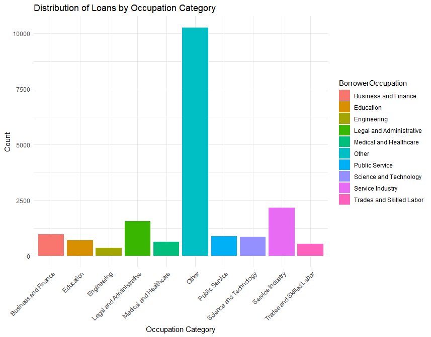
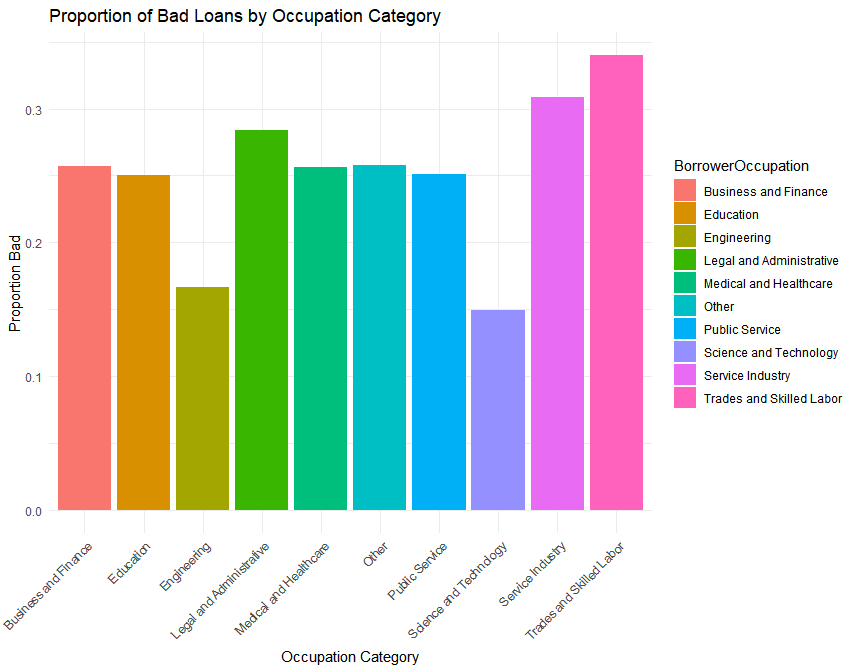
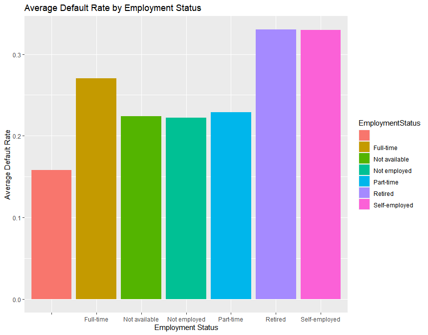
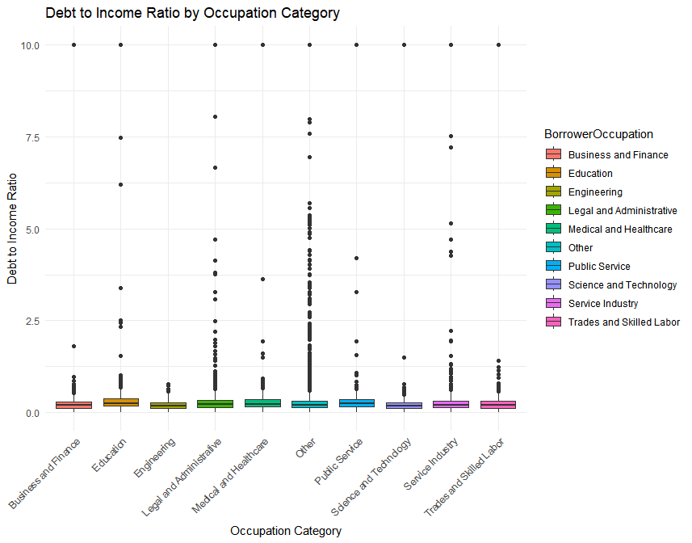
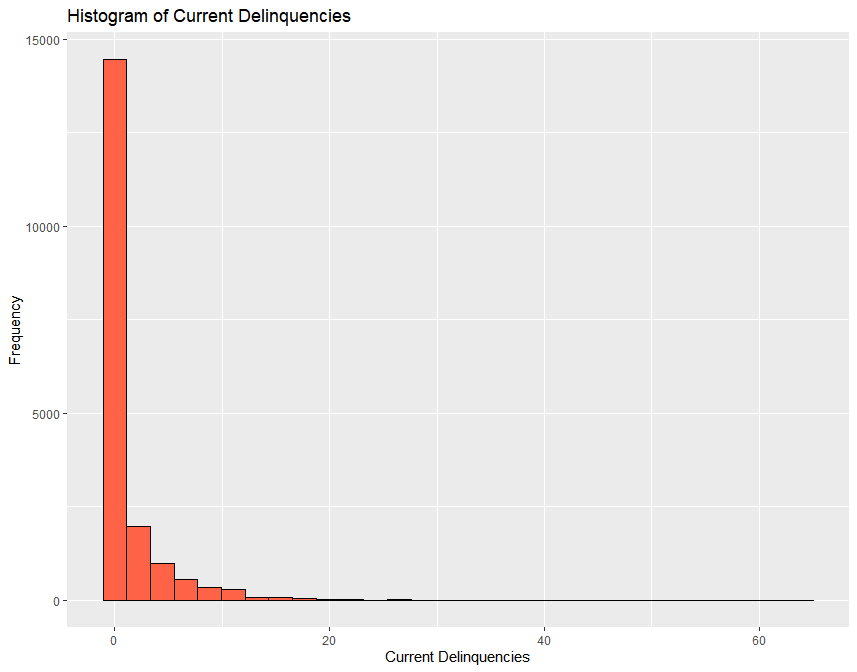
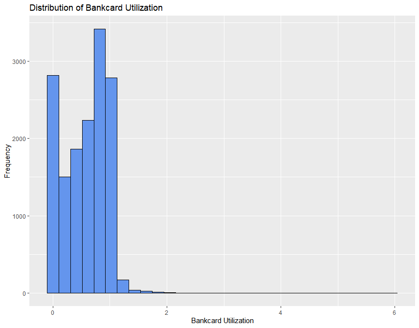
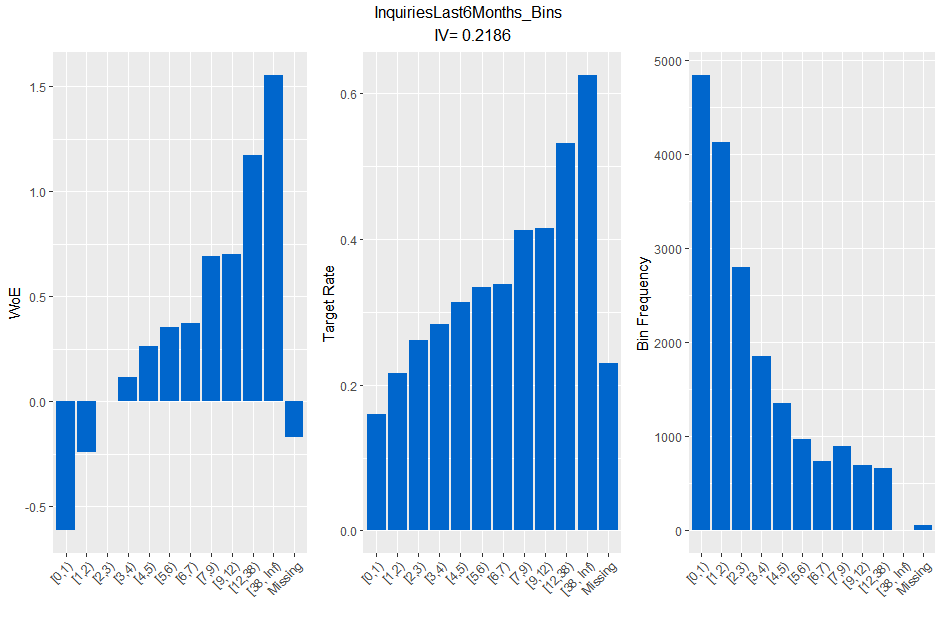

# Loan Default Prediction Using Weight of Evidence (WOE), Binning, and Machine Learning
## Overview
This project focuses on building predictive models to assess loan default risk using real-world data from Prosper.com. The goal is to develop accurate and interpretable models that identify borrowers who are at higher risk of default. The project follows a structured data science workflow, incorporating data cleaning, exploratory analysis, feature engineering, model development, and evaluation.

## Key Highlights
- Exploratory Data Analysis (EDA): Gained insights into borrower financial health, credit history, and loan performance.
- Feature Engineering: Applied binning techniques, handled missing values strategically, and transformed categorical data.
- Predicitve Modeling:
  - Logistic Regression (baseline model for interpretability)
  - Random Forest (more accurate model for stronger predictive power)
- Model Evaluation
  - Compared models using ROC-AUC scores, KS statistic, gains table, and feature importance analysis.
## Dataset Overview
The dataset used in this analysis comes from Prosper.com, a peer-to-peer lending platform. It includes detailed loan performance data, offering valuable insights into borrower creditworthiness and financial behavior. The dataset is structured as follows:
- Total observations: 18,987 rows (individual loans)
- Total Features: 30 columns relating to financial, demographic, and loan-related attributes
- Variable Types:
  - Numerical: Debt-to-Income Ratio, Amount Delinquent, Revolving Credit Balance
  - Categorical: Employment Status, Borrower State, Homeownership Status
  - Temporal: First Recorded Credit Line (originally stored as a timestamp)
- Target Variable: Bad (Binary: 1 = Loan Default, 0 = No Default)
## Data Preprocessing
Before analysis, several preprocessing steps were applied to clean and structure the data for modeling. These steps were executed with the drive to ensure data consistency and improve predictive power.
### 1. Handling Missing Data
The initial state of the dataset had 25,606 missing values, which made up about 11.24% of the total data. Some key financial variables, like Debt-to-Income Ratio, Public Records, and Bankcard Utilization, had missing values. Instead of removing these records and losing potentially valuable insights, missing values were intentionally categorized and binned to retain their predictive power.
#### Why Keep Missing Data?
Missing data is not always random and can actually provide some valuable insights into borrower behavior. Keeping and categorizing missing values allowed the model to recognize trends that could indicate borrower risk. In the context of this dataset, missing values were retained and binned because:
- They might indicate risk: Borrowers who don't share certain financial details may have different risk levels than those who do. For example, if someone doesn't report their income, it could be a sign of financial instability or hesitation to disclose their earnings.
- They help prevent bias: Removing missing data might unintentionally exclude certain groups of borrowers, which could make the model less accurate for new applicants.
- They help retain important insights: Since a large portion of the data is missing, removing it entirely would shrink the dataset and make it harder for the model to identify meaningful patterns related to default risk.
#### Approach to Handling Missing Data
To get the most out of the available data, we took the following steps:
- Categorizing Missing Values: Instead of filling in missing data with averages or random numbers, we treated them as their own category. This allowed the model to recognize patterns related to missing values rather than guessing what they might have been.
- Evaluating Predictive Power: We analyzed whether missing values were linked to loan defaults. By keeping them as a separate category, the model could use these patterns to better assess borrower risk.
By considering missing values as meaningful rather than as errors, the model was able to capture important risk factors and improve its ability to predict loan defaults. This approach led to a more accurate and fair assessment, aligning with real-world lending practices and the goals of this analysis.
Key financial metrics, such as Debt-to-Income Ratio, Public Records, and Bankcard Utilization, had missing values. Instead of removing these records and losing valuable insights, we categorized and grouped the missing values so the model could still recognize patterns and use them to assess risk.
### 2. Transforming Variables
To make the data more useful for modeling, some variables were adjusted:
- Credit History Length: The FirstRecordedCreditLine variable, originally stored as a timestamp, was converted into the number of years since the borrower’s first credit event. This provided a clearer measure of a borrower's credit history length.
- Homeownership Status: The IsBorrowerHomeowner variable, initially stored as TRUE/FALSE, was converted to binary values (1 = Yes, 0 = No) to improve compatibility with the machine learning models.
### 3. Binning Continuous Variables
A major preprocessing step was to bin continuous variables into categorical groups with the aim of enhancing model performance. This method was applied to:
- Debt-to-Income Ratio: Borrowers were grouped into bins based on their DTI levels, reducing noise and improving model interpretability.
- Credit Utilization & Delinquencies: Outliers in BankcardUtilization and CurrentDelinquencies were binned into structured categories to retain valuable insights while limiting their extreme impact on influencing the model’s predictions.
- Borrower Occupation Categorization: The BorrowerOccupation field originally contained unstructured, free-form text with a lot of variation. Many job titles were written in different ways (e.g., "Software Engineer" vs. "Software Developer"), making it difficult to analyze. To simplify the data and improve statistical reliability, similar occupations were grouped into broader categories:
  - Business & Finance (e.g., Accountants, Financial Analysts, Bankers)
  - Trades & Skilled Labor (e.g., Electricians, Carpenters, Plumbers)
  - Service Industry (e.g., Retail Workers, Hospitality, Food Service)
  - Healthcare & Education (e.g., Nurses, Teachers, Therapists)
  - Science & Technology (e.g., Engineers, IT Professionals, Data Scientists)
  - Other (e.g., Unemployed, Retired, Self-Employed with undefined roles)
By standardizing job titles into clear categories, the model could better identify trends in loan default risk while reducing the impact of inconsistent occupation labels.
### 4. Feature Selection
4. Feature Selection
Feature selection was a crucial step in ensuring that only the most relevant and impactful variables were used in predictive modeling. The objective was to retain features that contributed significantly to distinguishing between default and non-default loans while removing redundant or weak predictors.
#### Selection Process:
- Information Value (IV) Analysis: Variables were assessed based on their Information Value (IV) to determine their predictive power. Features with an IV greater than 0.025 were prioritized, as they provided meaningful separation between borrowers who defaulted and those who did not.
- Weight of Evidence (WOE) Transformation: Continuous variables were binned, and WOE values were calculated to create a more structured representation of risk levels within each variable. This transformation allowed the model to capture patterns in borrower behavior more effectively.
- Business Relevance: Features that align with financial risk assessment, such as Debt-to-Income Ratio, Credit Utilization, Delinquencies, and Employment Status, were included based on their real-world importance in assessing borrower creditworthiness.
- Multicollinearity Check: Highly correlated features were flagged, and only the most informative variables were retained to prevent redundancy and overfitting.
- Statistical Significance Testing: Features were tested for their statistical relationship with loan default, ensuring only those with meaningful impact were included in the final model.
#### Final Selected Features:
The highest-ranking features, based on IV scores, included:
- BorrowerCity_Bins (IV = 0.2725)
- InquiriesLast6Months_Bins (IV = 0.2186)
- BankcardUtilization_Bins (IV = 0.0879)
- CurrentDelinquencies_Bins (IV = 0.0805)
- AmountDelinquent_Bins (IV = 0.0722)
Other variables such as BorrowerOccupation_Bins, DebtToIncomeRatio_Bins, and PublicRecordsLast10Years_Bins were also included based on their moderate IV values, contributing to overall model performance. By carefully selecting features based on their predictive strength and real-world relevance, the final dataset was optimized for modeling, leading to a more interpretable and effective risk assessment model.

## Exploratory Data Analysis (EDA)
The exploratory data analysis (EDA) phase helped uncover important trends and relationships in borrower data, allowing us to better understand the factors that contribute to loan default. By analyzing distributions, correlations, and key financial indicators, we gained insights that guided feature selection and model development.
### Key Takeaways from EDA
EDA revealed clear patterns in borrower demographics, financial behaviors, and credit history that were strongly linked to loan default risk. Here are some of the most important findings:
- Loan Default Trends: Borrowers with lower credit scores, higher debt-to-income ratios, and shorter credit histories were more likely to default.
- Geographic Differences: Some states and metro areas had higher default rates than others, likely due to factors like local economic conditions, job market stability, or differences in lending policies.
- Income and Creditworthiness: Borrowers with higher incomes generally had better credit, but a high income didn’t always guarantee financial stability. Some high earners still defaulted, often due to high revolving credit balances or past delinquencies.
- Debt-to-Income Ratio Impact: Borrowers with a DTI ratio over 40% were significantly more likely to default on their loans.
- Credit Utilization & Delinquencies: Borrowers who used more than 80% of their available credit and had a history of multiple past delinquencies were at a significantly higher risk of defaulting.
- Borrowers working in trades, the service industry, and those who were self-employed tended to have higher default rates, whereas borrowers employed in technology, healthcare, and finance showed lower risk levels. This trend suggests that job stability and income predictability may play a key role in a borrower's ability to repay loans.
### Statistical & Distribution Analysis
- Correlation Analysis: Identified strong relationships between financial indicators and loan default, particularly credit utilization, delinquency count, and DTI ratio.
- Distribution Analysis: Examined borrower credit scores, annual income distributions, and loan amounts to distinguish key differences between defaulters and non-defaulters.
- Outlier Detection: Found extreme values in credit utilization and delinquency counts, which were addressed through binning and transformations during preprocessing (see above).
### Visualizing Loan Default Risk
To better understand the relationships between borrower characteristics and loan default risk, several data visualizations were created based on the insights gathered from EDA.

  - This bar chart illustrates the number of loans across different occupation categories. The "Other" category has the highest number of loans, reacall that job titles originally were entered as free text tehrefore this really emphasizes the wide range of borrowers whose job titles didn’t fit neatly into a specific category.

  - This visualization shows that trades, service industry, and public service occupations experience the highest default rates, indicating that employment stability plays a key role in loan repayment ability.

  - Retired and self-employed borrowers show the highest loan default rates, suggesting that income stability is a strong predictor of credit risk.

  - This box plot shows how debt-to-income ratios vary across different occupation groups. While most categories have a similar median DTI, outliers exist in every category, affecting overall risk assessment.

  - Most borrowers have no delinquencies, but a small group has a high number of delinquencies, making it an important risk factor to consider.

  - Most borrowers keep their credit utilization low, but a small group with very high utilization stands out. These overextended borrowers may be at a higher risk of default.

  - Weight of Evidence (Left Plot): WoE measures how strongly a feature separates good vs. bad borrowers. Positive WoE means higher risk, while negative WoE means lower risk. Borrowers with 0 inquiries have a negative WoE, therefore present lower risk. While contrarily, those with 13+ inquiries have the highest WoE, and are therefore strongly linked to a higher risk of defaulting.
  - More Credit Inquiries = Higher Default Risk (Middle Plot): The default rate increases as the number of inquiries goes up. Borrowers with fewer inquiries are generally more reliable, while those with 6 or more inquiries are much more likely to default, possibly because they’re struggling financially or frequently seeking new credit.
  - Most Borrowers Have Few Inquiries (Right Plot): The majority of borrowers fall into the 0-2 inquiries range, meaning frequent credit applications are uncommon. This reinforces the idea that borrowers with many inquiries might be outliers and at higher risk.
  - Only a small number of borrowers have missing inquiry data, as shown in the bin frequency plot (right). Their slightly negative WoE suggests they have a lower risk of default, similar to borrowers with 0 inquiries. Unlike borrowers with many inquiries, missing values don’t show a clear link to higher risk. Instead of removing these records, treating them as a separate category allows the model to capture any hidden patterns that might still be relevant
The exploratory data analysis revealed key factors influencing loan default, providing critical insights through statistical evaluations and visualizations. High-risk borrower profiles were identified, particularly among those with high debt-to-income (DTI) ratios, frequent credit inquiries, and elevated bankcard utilization. Employment and income stability also played a major role, with self-employed and retired borrowers showing higher default rates. Additionally, geographic location and occupation were found to impact default probability, as certain regions and job sectors had higher risk levels. Credit history and past delinquencies emerged as strong predictors of default, reinforcing their importance in risk assessment. These findings directly shaped our feature engineering and model selection, helping us refine our approach and build more effective predictive models for assessing borrower risk.
